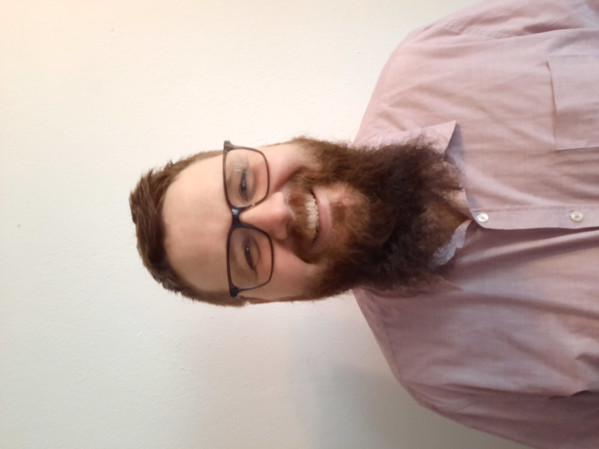

# Resume

## Persönliche Daten
- **Name:** Lars Milz
- **E-Mail:** milzlars88@gmail.com

## Professional Summary
Senior Software Engineer with extensive experience in embedded systems, energy management, 
and functional safety for hybrid and electric vehicles. Skilled in modern software development 
with C and C++, agile methodologies, and tool development. 
Background in theoretical physics with expertise in complex systems, advanced modeling, and data analysis.

## Professional Experience
### Senior Software Engineer - CARIAD SE
**01/2024 - Now**
- Led the development of software components in C, C++ and model-based tools forelectrical powertrains vehicles. 
- Work within an agile product team using the SAFe framework, applying Scrum and Lean methodologies to improve workflows and deliverables. 
- Supported system integration and testing activities in both virtual and physical environments, ensuring seamless communication between software and hardware components.- Led the development of software components in C, C++ and model-based tools forelectrical powertrains vehicles. - Work within an agile product team using the SAFe framework, applying Scrum and Lean methodologies to improve workflows and deliverables. - Supported system integration and testing activities in both virtual and physical environments, ensuring seamless communication between software and hardware components.

### Software Engineer - CARIAD SE
**04/2022 - 12/2023**
- Led the development of software components in C, C++ and model-based tools forelectrical powertrains vehicles. 
- Work within an agile product team using the SAFe framework, applying Scrum and Lean methodologies to improve workflows and deliverables. 
- Supported system integration and testing activities in both virtual and physical environments, ensuring seamless communication between software and hardware components.- Led the development of software components in C, C++ and model-based tools forelectrical powertrains vehicles. - Work within an agile product team using the SAFe framework, applying Scrum and Lean methodologies to improve workflows and deliverables. - Supported system integration and testing activities in both virtual and physical environments, ensuring seamless communication between software and hardware components.

### Development Engineer - IAV GmbH
**10/2018 - 03/2022**
- Development of Functions for Hybrid and Electric Vehicles: Designed and implemented control functions to optimize the performance and efficiency of hybrid and electric vehicle systems, including energy management, power distribution, and fault diagnostics.
- Functional Safety for Power Electronics: Focused on the verification and validation of functional safety concepts for power electronics systems, ensuring compliance with safety standards and the implementation of robust safety mechanisms to mitigate risks in critical components.
- Agile Master: Facilitated agile practices and principles within development teams, enabling efficient workflows, improved collaboration, and successful delivery of projects within the framework of Scrum and Kanban.
- Tool Development: Created and maintained specialized tools to support software development processes, testing, and system simulation, improving efficiency and accuracy across the development lifecycle.
- Data Science and Machine Learning: Applied advanced data analytics and machine learning algorithms to extract actionable insights and enable predictive diagnostics for automotive systems.

## Education
Ph.D. in Physics – [University Regensburg]
[Regensburg, Germany] | [2018]

Master of Science in Physics – [University Regensburg]
[Regensburg, Germany] | [2014]

Bachelor of Science in Physics – [Heinrich-Heine University]
[Düsseldorf, Germany] | [2012]

## Skills
- **Programming Languages:** C, C++, Python
- **Tools:** Git, Docker, Jenkins
- **Standards and Practices:** AUTOSAR, Agile (SAFe, Scrum), ASPICE,
- **Languages:** Deutsch (Muttersprache), Englisch (fließend)